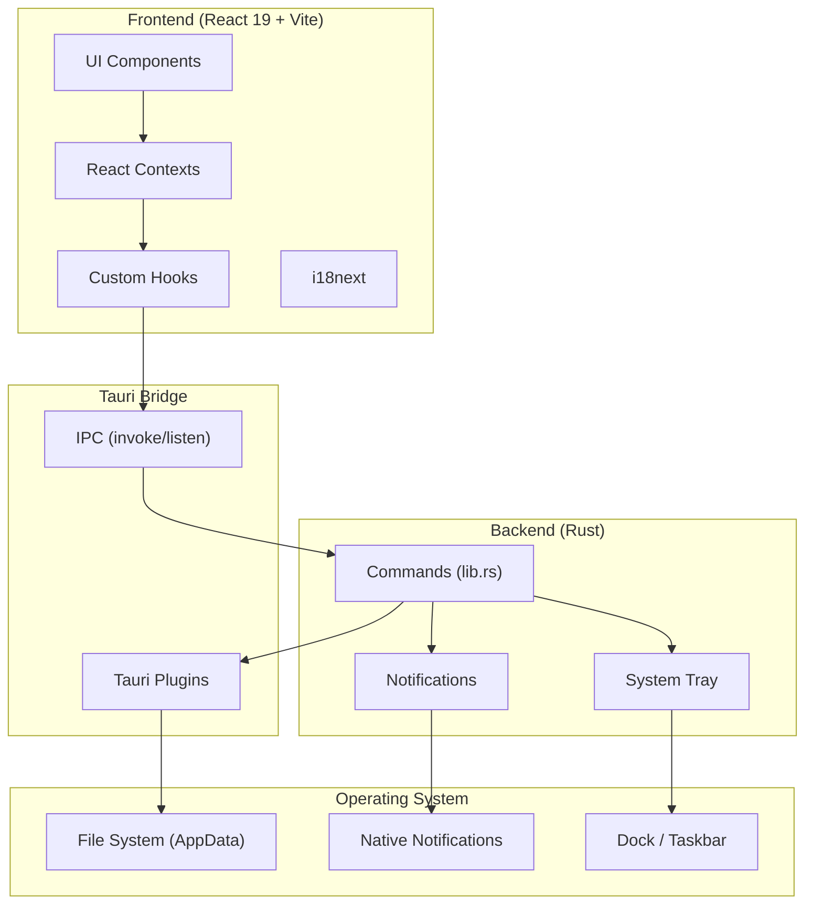

# Omni Clock 架构文档

本文档详细描述 Omni Clock 的系统架构、组件设计、数据流和关键技术决策。

---

## 目录

1. [高层架构](#高层架构)
2. [目录结构](#目录结构)
3. [状态管理架构](#状态管理架构)
4. [计时器精度设计](#计时器精度设计)
5. [组件层次](#组件层次)
6. [数据持久化](#数据持久化)
7. [后端（Rust）架构](#后端rust架构)
8. [主题与样式系统](#主题与样式系统)
9. [国际化架构](#国际化架构)
10. [自动更新机制](#自动更新机制)

---

## 高层架构

Omni Clock 采用经典的 **Tauri 架构**：前端使用 Web 技术栈（React + TypeScript），后端使用 Rust 提供原生能力（文件系统、通知、系统托盘、自动启动等）。



---

## 目录结构

```
OmniClock/
├── src/                          # 前端源码
│   ├── components/               # React 组件
│   │   ├── ui/                   # 基础 UI 组件（Button, Switch, Slider 等）
│   │   ├── Timer/                # 分段计时器模块
│   │   ├── Pomodoro/             # 番茄钟模块
│   │   ├── Stopwatch/            # 秒表模块
│   │   ├── Countdown/            # 倒计时模块
│   │   ├── Settings/             # 设置页面
│   │   ├── CustomTitleBar.tsx    # 自定义标题栏
│   │   └── ErrorBoundary.tsx     # 错误边界
│   ├── contexts/                 # React Context（状态管理）
│   │   ├── TimerContext.tsx      # 计时器配置 + 全局设置
│   │   ├── PomodoroContext.tsx   # 番茄钟状态
│   │   ├── StopwatchContext.tsx  # 秒表状态
│   │   ├── CountdownContext.tsx  # 倒计时状态
│   │   └── ThemeContext.tsx      # 主题管理
│   ├── hooks/                    # 自定义 Hooks
│   │   └── useUpdateCheck.ts     # 自动更新检查
│   ├── utils/                    # 工具函数
│   │   ├── storage.ts            # 文件持久化读写
│   │   ├── sound.ts              # Web Audio API 音效
│   │   ├── time.ts               # 时间/ID 工具
│   │   ├── version.ts            # 版本号导出
│   │   └── autostart.ts          # 开机自启动设置
│   ├── types/                    # TypeScript 类型定义
│   │   └── index.ts
│   ├── i18n/                     # 国际化
│   │   ├── index.ts              # i18n 初始化
│   │   └── locales/              # 翻译文件（6 种语言）
│   ├── lib/
│   │   └── utils.ts              # cn() 工具（clsx + tailwind-merge）
│   ├── App.tsx                   # 根组件 + 布局
│   ├── main.tsx                  # 入口文件
│   └── index.css                 # 全局样式 + Tailwind
├── src-tauri/                    # Tauri / Rust 后端
│   ├── src/
│   │   ├── lib.rs                # 主库：托盘、通知、命令
│   │   └── main.rs               # 二进制入口
│   ├── capabilities/
│   │   └── default.json          # Tauri 权限配置
│   ├── icons/                    # 应用图标
│   ├── tauri.conf.json           # Tauri 配置文件
│   └── Cargo.toml                # Rust 依赖
├── .github/
│   └── workflows/
│       └── release.yml           # GitHub Actions 发布流程
├── docs/                         # 项目文档
├── package.json
├── vite.config.ts
├── tsconfig.json
└── README.md
```

---

## 状态管理架构

Omni Clock 使用 **React Context + useReducer** 进行状态管理，按模块划分为独立的 Context，通过 Provider 嵌套实现组合。

### Provider 嵌套层次

```
ThemeProvider          # 最外层，独立管理主题
└── TimerProvider      # 全局设置 + 分段计时器配置/状态
    └── PomodoroProvider   # 番茄钟状态（依赖 TimerProvider 读取 settings）
        └── StopwatchProvider  # 秒表状态
            └── CountdownProvider  # 倒计时状态
                └── CustomTitleBar   # 读取 settings.closeToTray
                └── ErrorBoundary
                    └── TrayEventHandler  # 使用 PomodoroContext
                    └── AppContent        # 主内容区
```

### 为什么不用 Redux / Zustand？

项目规模适中，Context + useReducer 已足够：
- 状态更新路径清晰，每个 Context 有明确的 Action 类型。
- 避免了引入外部依赖的 bundle 体积开销。
- 利用 `useRef` 解决闭包陈旧问题（见下文），无需中间件。

### 核心 Context 职责

| Context | 职责 | 依赖 |
|---------|------|------|
| `ThemeContext` | 主题（light/dark/system）、localStorage 持久化 | 无 |
| `TimerContext` | 分段计时器配置 CRUD、计时器运行状态、全局设置（通知/声音/自启动/托盘） | 无 |
| `PomodoroContext` | 番茄钟工作/休息循环、自动切换、设置 | `TimerContext`（读取 settings） |
| `StopwatchContext` | 秒表计时、圈速记录 | 无 |
| `CountdownContext` | 倒计时计时、时间编辑 | 无 |

---

## 计时器精度设计

**核心挑战**：浏览器在后台标签页会节流 `setInterval` 至最低约 1Hz，导致基于 tick 的倒计时在后台运行时严重失准。此外，电脑休眠/熄屏会冻结 `setInterval` 和 `setTimeout`。

### 混合计时策略（Hybrid Timing）

所有倒计时类计时器（Timer、Pomodoro、Countdown）均采用以下混合模式：

#### 1. 显示刷新（Display Tick）

使用 `setInterval(fn, 100)` 每 100ms 刷新一次显示，但**不依赖 tick 累加**，而是基于 `Date.now() - startedAt` 实时计算：

```typescript
const updateDisplay = () => {
  const now = Date.now();
  const elapsed = Math.floor((now - startedAtRef.current) / 1000);
  const remaining = Math.max(0, initialSecondsRef.current - elapsed);
  dispatch({ type: 'TICK', payload: { remainingSeconds: remaining, ... } });
};
```

这样即使 `setInterval` 被节流到 1s 一次，显示仍会通过 `Date.now()` 的差值立即追上真实时间，不会累积漂移。

#### 2. 状态转换调度（Transition Timeout）

单独使用 `setTimeout` 调度精确的状态转换（ segment 切换、工作→休息、计时结束）：

```typescript
const endTime = startedAtRef.current + (seconds * 1000);
const delay = endTime - Date.now();
timeoutRef.current = window.setTimeout(() => {
  // 执行 segment 切换或计时结束
}, delay);
```

这样即使显示 tick 被节流，状态转换仍会在正确的时间点发生。

#### 3. 休眠/熄屏恢复（Sleep Resilience）

当电脑休眠后恢复，`setTimeout` 可能丢失或延迟触发。设置了双重保险：

**保险 A —— 显示 tick 兜底**：
在 `updateDisplay` 中，当 `remaining === 0` 时，立即清除旧的 timeout 并主动调用转换逻辑：

```typescript
if (remaining === 0 && timeoutRef.current) {
  clearTimeout(timeoutRef.current);
  timeoutRef.current = null;
  scheduleSegmentTransition(state.currentSegmentIndex);
}
```

**保险 B —— `visibilitychange` 监听**：
当应用从后台/休眠恢复变为可见时，强制重新计算当前时间、清除旧 timeout、重新调度转换。由于 `Date.now()` 已经跳过了休眠时间，重新计算的 `delay <= 0` 会立即触发所有 overdue 的转换（包括跳过多个 segment）。

```typescript
document.addEventListener('visibilitychange', () => {
  if (document.visibilityState === 'visible') {
    updateDisplay();
    if (timeoutRef.current) clearTimeout(timeoutRef.current);
    scheduleSegmentTransition(currentSegmentIndex);
  }
});
```

### 秒表为什么不需要这些？

秒表（Stopwatch）没有**预定状态转换**，它只计算 `Date.now() - startTime` 的差值。即使休眠后恢复，差值自然包含休眠时间，秒表会自动追上，无需额外处理。

---

## 组件层次

### 布局结构

```
┌─────────────────────────────────────────┐
│ CustomTitleBar (自定义标题栏, 可拖拽)      │
├──────────┬──────────────────────────────┤
│          │                              │
│ Sidebar  │      Main Content            │
│ (224px)  │      (max-width: 512px)      │
│          │                              │
│ - Timer  │                              │
│ - Pomodoro                              │
│ - Stopwatch                             │
│ - Countdown                             │
│ - Settings                              │
│          │                              │
│ [Version]│                              │
└──────────┴──────────────────────────────┘
```

- **Sidebar**: 左侧导航栏，固定宽度，包含 Logo、模块切换按钮、版本号。
- **Main Content**: 右侧主内容区，使用 `max-w-2xl` 限制最大宽度，居中显示当前模块的视图。
- **CustomTitleBar**: 顶部自定义标题栏（`decorations: false`），包含窗口控制按钮（最小化/最大化/关闭），支持原生拖拽（`data-tauri-drag-region`）。

### 模块视图

每个模块视图位于 `src/components/{Module}/`：

| 模块 | 入口组件 | 核心功能 |
|------|----------|----------|
| Timer | `TimerView.tsx` | 配置列表、运行界面、控制按钮、配置表单 |
| Pomodoro | `PomodoroView.tsx` | 工作/休息显示、循环计数、控制按钮 |
| Stopwatch | `StopwatchView.tsx` | 时间显示、圈速列表、控制按钮 |
| Countdown | `CountdownView.tsx` | 时间编辑、环形进度、控制按钮 |
| Settings | `SettingsView.tsx` | 各项设置开关、语言选择、更新检查 |

---

## 数据持久化

数据通过 Tauri `fs` 插件存储在应用数据目录（AppData）中：

| 文件 | 路径（相对 AppData） | 内容 | 读写位置 |
|------|----------------------|------|----------|
| `configs.json` | `OmniClock/data/configs.json` | `TimerConfig[]` | `src/utils/storage.ts` |
| `settings.json` | `OmniClock/data/settings.json` | `Settings` | `src/utils/storage.ts` |
| `pomodoro.json` | `OmniClock/data/pomodoro.json` | `PomodoroSettings` | `src/utils/storage.ts` |

### 运行时校验

所有加载函数在解析 JSON 后都会进行**结构校验**，防止损坏文件导致应用崩溃：

```typescript
function isValidTimerConfig(item: unknown): boolean {
  // 校验 id, name, segments 等字段类型
}
```

如果校验失败，返回安全默认值（空数组或默认设置），并在控制台报错。

### 平台路径

| 平台 | 绝对路径 |
|------|----------|
| Windows | `%APPDATA%\OmniClock\data\` |
| macOS | `~/Library/Application Support/OmniClock/data/` |
| Linux | `~/.config/OmniClock/data/` |

---

## 后端（Rust）架构

Rust 后端位于 `src-tauri/src/lib.rs`，核心职责：

### 1. 系统托盘（Desktop Only）

```rust
#[cfg(not(mobile))]
setup_tray(app.handle())?;
```

托盘功能：
- 左键点击：显示并聚焦窗口
- 右键菜单：Show / Hide / Start Work / Quit
- `Start Work` 发射 `tray-start-work` 事件到前端，触发番茄钟开始工作
- 菜单标签支持国际化动态更新（`update_tray_labels` 命令）

### 2. 通知发送

跨平台通知实现：
- **macOS**: 使用 `osascript -e "display notification..."` 通过 AppleScript 发送，规避 Tauri 通知插件在 macOS 上的已知问题。
- **Windows/Linux**: 使用 `tauri_plugin_notification::NotificationExt` 原生发送。

前端统一调用 `invoke('send_notification', { title, body })`，平台分支在 Rust 层处理。

### 3. 自动重启

```rust
#[tauri::command]
fn relaunch_app(app: AppHandle) {
    app.restart();
}
```

更新下载完成后，前端调用此命令重启应用。

### 4. 插件注册

```rust
.plugin(tauri_plugin_autostart::init(
    tauri_plugin_autostart::MacosLauncher::LaunchAgent,
    Some(vec!["--minimized"]),
))
```

**注意**：`MacosLauncher::LaunchAgent` 这个枚举名称具有误导性，实际上它跨平台工作。不要修改为其他变体，否则在 CI 构建器上会失败。

---

## 主题与样式系统

### CSS 变量主题

使用 Tailwind CSS v4 的 `@theme inline` 语法，在 `:root`（亮色）和 `.dark`（暗色）中定义 CSS 变量：

```css
:root {
  --background: oklch(1 0 0);
  --foreground: oklch(0.145 0 0);
  --primary: oklch(0.205 0 0);
  /* ... */
}
.dark {
  --background: oklch(0.145 0 0);
  --foreground: oklch(0.985 0 0);
  /* ... */
}
```

### 自定义工具类

- `.button-scale`：悬停放大（1.05）+ 弹簧动画，点击缩小（0.98）
- 自定义滚动条样式（8px 宽度，适配主题色）

### 组件库

`src/components/ui/` 下的基础组件：
- `Button` — 6 种变体（default, destructive, outline, secondary, ghost, link）
- `Switch`, `Slider`, `Label`, `Separator`
- 全部使用 `class-variance-authority` 处理变体样式

---

## 国际化架构

- **库**: i18next + react-i18next + i18next-browser-languagedetector
- **语言**: 英语、简体中文、繁体中文、日语、法语、德语（6 种）
- **存储**: 语言偏好保存在 `localStorage` 的 `'language'` 键中
- **翻译文件**: `src/i18n/locales/{lang}.json`
- **命名空间**: 统一使用 `app`, `nav`, `timer`, `pomodoro`, `stopwatch`, `countdown`, `settings`, `common`
- **托盘标签**: 语言切换时通过 `invoke('update_tray_labels', ...)` 同步更新 Rust 层托盘菜单文本

---

## 自动更新机制

### 前端（`src/hooks/useUpdateCheck.ts`）

1. 调用 `check()` 从 `@tauri-apps/plugin-updater` 检查更新
2. 若有更新，弹出原生确认对话框
3. 用户确认后，调用 `downloadAndInstall()` 并监听进度事件：
   - `Started` / `Progress` / `Finished`
4. 下载完成后提示用户重启，调用 `invoke('relaunch_app')`
5. 错误处理覆盖常见场景：网络失败、manifest 缺失等

### 后端

- `tauri.conf.json` 中配置 `pubkey` 和 `endpoints`
- 端点指向 `https://github.com/mikannse/OmniClock/releases/latest/download/latest.json`
- CI 构建时通过 `TAURI_SIGNING_PRIVATE_KEY` 签名更新产物

### macOS 注意事项

应用当前未签名（缺少 Apple Developer ID）。macOS Gatekeeper 可能阻止 `downloadAndInstall` 替换 `.app` 包。错误会通过对话框提示用户。

---

## 关键设计决策

| 决策 | 选择 | 理由 |
|------|------|------|
| 状态管理 | Context + useReducer | 规模适中，避免 Redux 开销；Action 类型提供可预测性 |
| 计时策略 | `Date.now()` 差值 + `setTimeout` 调度 | 解决后台标签节流和休眠冻结问题 |
| 持久化 | JSON 文件（Tauri fs） | 简单可靠，无需数据库；支持运行时校验 |
| 主题系统 | CSS 变量 + Tailwind v4 | 轻量、无闪烁、支持 system 模式 |
| 通知 | AppleScript (macOS) / Tauri 插件 (Win/Linux) | 规避 macOS Tauri 通知插件的已知问题 |
| 构建 | GitHub Actions + Tauri Action | 跨平台自动化构建和签名 |
